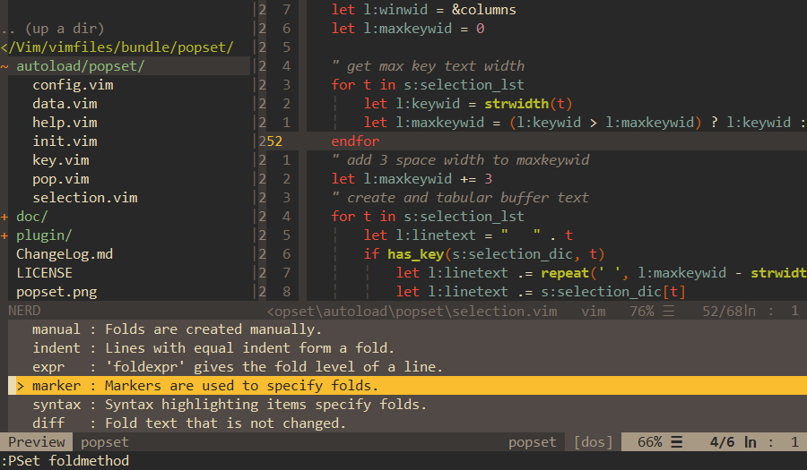

**Popset** is a vim plugin to `Pop selections for vim option settings`, which will be convinient for setting vim options.

**Popset** is inspired bySzymon Wrozynski plugin [vim-CtrlSpapce](https://github.com/vim-ctrlspace/vim-ctrlspace) and some plugin code of popset is based on vim-ctrlspace and Thanks a lot.


---
## Installation

For vim-plug, add to your `.vimrc`:

```vim
Plug 'yehuohan/popset'
```

---
## Settings

 - Please set `nocompatible` and `hidden` options:

```vim
set nocompatible
set hidden
```

---
## Usage

There is only one command `PSet`, which is similar to `set` command, in popset.
For example:
```
:PSet foldmethod
```


In popset view, you can use following command:

```    
q       : Quit pop selection
j       : Move the selection bar down
k       : Move the selection bar up
<C-j>   : Move the selection bar one screen up
<C-k>   : Move the selection bar one screen down
<CR>    : Load the selection
<Space> : Previous the selection
?       : Show Help
```

 - Set Completion of `PSet` by `g:Popset_CompleteAll`:

```vim
let g:Popset_CompleteAll = 1    " auto complete all command of vim
let g:Popset_CompleteAll = 0    " auto complete commands surpported by popset
```

 - Add your own selections by adding the following example code to `.vimrc`:

```vim
    let g:Popset_SelectionData = [
        \{
            \ "opt" : ["filetype", "ft"],
            \ "lst" : ["cpp", "c", "python", "vim", "markdown", "text"],
            \ "dic" : {
                    \ "python" : "python script file",
                    \ "vim": "Vim script file",
                    \ },
            \ "cmd" : "g:SetEqual",
        \},
        \]
    function! g:SetEqual(sopt, arg)
        execute "set " . a:sopt . "=" . a:arg
    endfunction
```

The key `opt` is the option name list to add, `lst` is the selections of the `opt`, `dic` is simple description of `lst` and `dic` can be empty, and `cmd` is the function that must execute with `opt` and `lst` args. In the example code, for example, the `g:SetEqual` will function as `set filtype=cpp` if you choose the selenction `cpp` for `lst`.


---
## Contributor
 - yehuohan, yehuohan@qq.com, yehuohan@gmail.com
