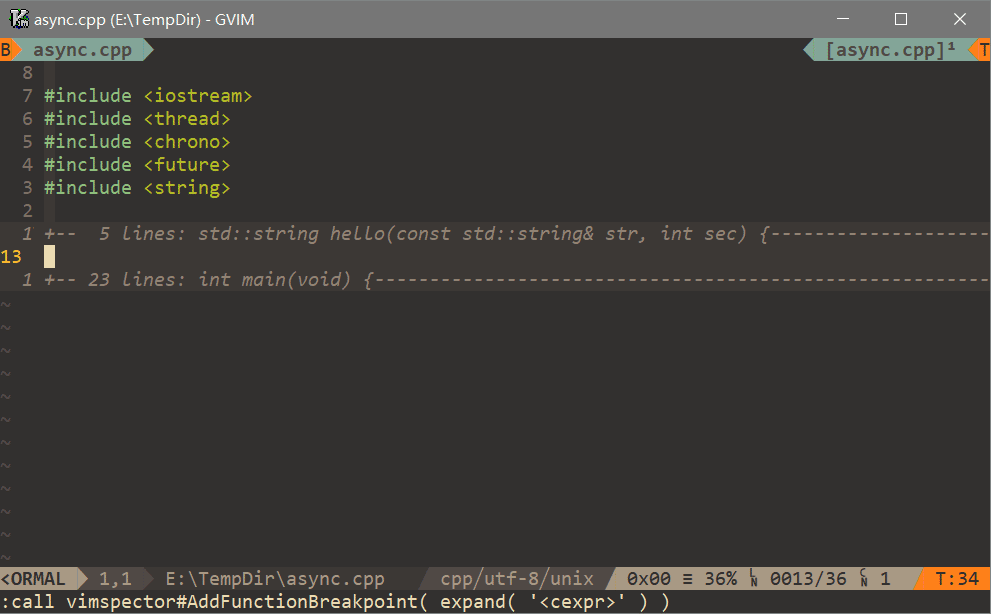
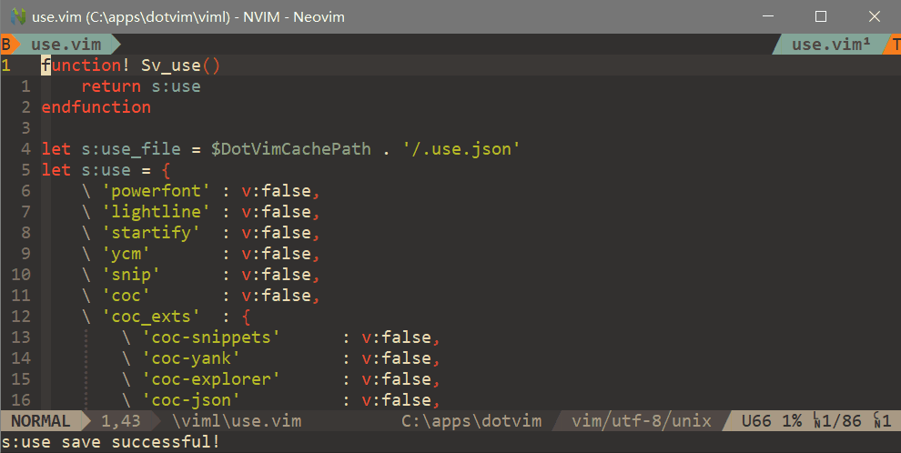

 - [Command](#3)
    - [PopSet](#3.1)
 - [Function](#4)
    - [PopSelection](#4.1)
 - [Help doc](#5)

---

**Popset** is a vim plugin to `Pop selections for operation`, which will be convinient for setting vim options, executing function with args and so on. **Popset** is implementated with [popc](https://github.com/yehuohan/popc).

For vim-plug, add to your `.vimrc`:

```vim
Plug 'yehuohan/popc'        " Must add before popset
Plug 'yehuohan/popset'
```

---
<h2 id="3">Command Usage</h2>

<h3 id="3.1">PopSet</h3>

There is only one command `PopSet`, which is similar to `set` command, in popset. What can be set by `PopSet` is all in `popset internal data`.

<div align="center">

</div>

 - Add selections to `g:Popset_SelectionData` as `popset internal data`:

```vim
"   {
"       'opt' : string-list
"       'lst' : string-list
"       'dic' : string-dict or sub-dict
"       'dsr' : string or funcref or lambda
"       'cpl' : 'completion' used same to input()
"       'cmd' : function-name or funcref or lambda
"       'get' : function-name or funcref or lambda
"       'sub' : common dictionary of 'lst', 'dsr', 'cpl', 'cmd', 'get' for sub-selection
"       'onCR' : function-name or funcref or lambda
"   }

let g:Popset_SelectionData = [
    \{
        \ "opt" : ["filetype", "ft"],
        \ "lst" : ["cpp", "c", "python", "vim", "markdown", "text"],
        \ "dic" : {
                \ "python" : "python script file",
                \ "vim": "Vim script file",
                \ },
        \ "dsr" : 'When this option is set, the FileType autocommand event is triggered.',
        \ "cpl" : 'filetype',
        \ "cmd" : "SetEqual",
        \ "get" : "GetValue"
    \}
    \]
function! SetEqual(sopt, arg)
    execute "set " . a:sopt . "=" . a:arg
endfunction
function! GetValue(sopt)
    return eval("&".a:sopt)
endfunction
```

*`opt`:* `opt` is the option name list. `opt[0]` should be fullname of the option, and `opt[1:-1]` can be the shortname for opt[0] if existed. Popset will take two options as the same option when "opt[0]" is equal. If the `opt` your add had been existed in popset, popset would only append the `lst` and `dic` but not override the existed one.

*`lst`:* `lst` is the selection list of the `opt`.

*`dic`:* `dic` is a description or sub-selection, who's key is from `lst`.

*`dsr`:* `dsr` is the description of `opt`. If its type is funcref or lambda, it must return a string of description. Function is in format 'func(opt)'.

*`cpl`:* `cpl` is completion for input selection value.

*`cmd`:* `cmd` is a callback which execute with args of `opt` and the selected item of `lst`. In the example code, the `SetEqual` will function as `set filtype=cpp` if you choose the selenction `cpp` from `lst`. Function is in format 'func(opt, sel, [args])'.

*`get`:* `get` is a function used to get the value of `opt`. Function is in format 'func(opt)'.

*`sub`:* `sub` is a dictionary used to supply common `cpl`, `cmd`, `get` for sub-selection.

*`onCR`:* `onCR` is a function used to response to key <CR> prior to 'cmd'. Function is in format 'func(opt, [args])'.

 - Show all the surpported options of popset:

```vim
:PopSet popset
```
All the surpported options is according to vim-help-doc.


---
<h2 id="4">Function Usage</h2>

<h3 id="4.1">PopSelection</h3>

`PopSelection(dict)` is used to pop selections with given `dict`. The `dict` is similar to g:Popset_SelectionData, but **NOT** belong to `popset internal data`.

`dict` must be in the format:

```vim
"   {
"       'opt' : string-list or string
"       'lst' : string-list
"       'dic' : string-dict or sub-dict
"       'dsr' : string or funcref or lambda
"       'cpl' : 'completion' used same to input()
"       'cmd' : function-name or funcref or lambda
"       'get' : function-name or funcref or lambda
"       'sub' : common dictionary of 'lst', 'dsr', 'cpl', 'cmd', 'get' for sub-selection
"       'arg' : any type
"       'onCR' : function-name or funcref or lambda
"   }
```

*`opt`:* Descriptiong of selection which is **NOT** requeried be different from each other. When it's list, `opt[0]` is used.

*`lst`*, *`dic`*, *`dsr`*, *`cpl`*, *`cmd`*, *`get`*, *`sub`*, *`onCR`:* Similar to used in `popset internal data`.

*`arg`:* `arg` is the extra-args passed to `cmd`. If `cmd` doesn't need extra-args, the `dict` must **NOT** contain the `arg` key.

- A example with sub-selection:

```vim
let s:menu = {
    \ "opt" : ["Which action to execute?"],
    \ "lst" : ["new file", "open file"],
    \ "dic" : {
            \ "new file" : {
                \ "opt" : ["menu new file"],
                \ "lst" : ["a.py", "b.vim"],
                \ "dsr" : "create new file",
                \ "cmd" : {sopt, arg -> execute(":e " . arg)}
                \ },
            \ "open file" : {
                \ "opt" : ["menu open file"],
                \ "lst" : ["c.py", "d.vim"],
                \ "dsr" : "open existed file",
                \ "cmd" : {sopt, arg -> execute(":e " . arg)}
                \ }
            \ },
    \ }
" show selection
call PopSelection(s:menu)
```

- A example of selection for setttings from [use.vim](https://github.com/yehuohan/dotconfigs/blob/master/vim/.vim/viml/use.vim):

<div align="center">

</div>

---
<h2 id="5">Help doc</h2>

More help about popset please see [popset.txt](doc/popset.txt) and [popc.txt](https://github.com/yehuohan/popc/blob/master/doc/popc.txt)
