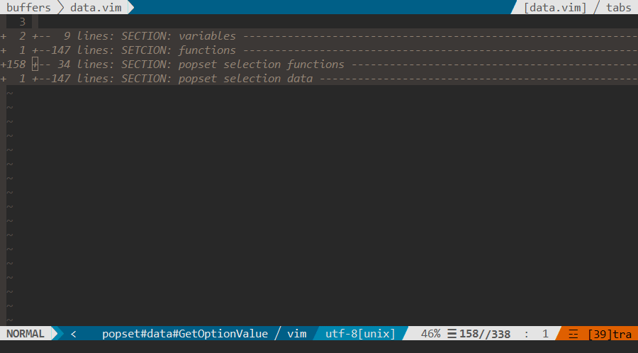
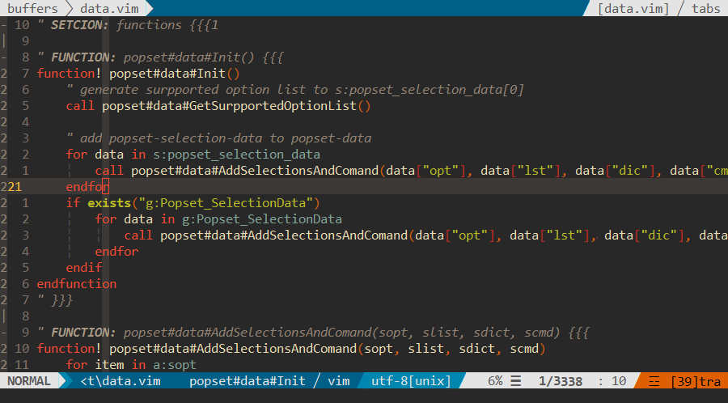

 - [Installation](#1)
 - [Settings](#2)
 - [Command Usage](#3)
    - [PSet](#3.1)
 - [Function Usage](#4)
    - [PopSelection](#4.1)
 - [Help doc](#5)
 - [Contributor](#6)

---

**Popset** is a vim plugin to `Pop selections for operation`, which will be convinient for setting vim options, executing some function and so on.

**Popset** is inspired bySzymon Wrozynski plugin [vim-CtrlSpapce](https://github.com/vim-ctrlspace/vim-ctrlspace) and some plugin code of popset is based on vim-ctrlspace and Thanks a lot.


---
<h2 id="1">Installation</h2>

For vim-plug, add to your `.vimrc`:

```vim
Plug 'yehuohan/popset'
```

---
<h2 id="2">Settings</h2>

 - Set `nocompatible` options:

```vim
set nocompatible
```

---
<h2 id="3">Command Usage</h2>

<h3 id="3.1">PSet</h3>

There is only one command `PSet`, which is similar to `set` command, in popset.
Example for `foldmethod`:

```
:PSet foldmethod
```



Example for `colorscheme`:
```
:PSet colorscheme
```



In popset view, you can use following command:

```    
q       : Quit pop selection
j       : Move the selection bar down
k       : Move the selection bar up
<C-j>   : Move the selection bar one screen down
<C-k>   : Move the selection bar one screen up
<CR>    : Load the selection
<Space> : Preview the selection
?       : Show Help
```

 - Set Completion of `PSet` by `g:Popset_CompleteAll`:

```vim
let g:Popset_CompleteAll = 1    " auto complete all command of vim
let g:Popset_CompleteAll = 0    " auto complete commands surpported by popset
```

 - Add your own selections by adding the following example code to `.vimrc`:

```vim
let g:Popset_SelectionData = [
    \{
        \ "opt" : ["filetype", "ft"],
        \ "lst" : ["cpp", "c", "python", "vim", "markdown", "text"],
        \ "dsr" : 'When this option is set, the FileType autocommand event is triggered.',
        \ "dic" : {
                \ "python" : "python script file",
                \ "vim": "Vim script file",
                \ },
        \ "cmd" : "g:SetEqual",
    \},
    \]
function! g:SetEqual(sopt, arg)
    execute "set " . a:sopt . "=" . a:arg
endfunction
```

    - `opt`(necessary):
`opt` is the option name list. `opt[0]` should be fullname of the option, and `opt[1:-1]` can be the shortname for opt[0] if existed. Popset will think two options as the same option when "opt[0]" is equal. If the `opt` your add had been existed in popset, popset will append the `lst` and `dic` (no `cmd`) but not override the existed one. Hence, the `opt` of options you add must be different to other `opt` of options, or you'll mix up the `lst` and `dic` of different options.

    - `lst`(necessary):
`lst` is the selection list of the `opt`.

    - `dic`(not necessary):
`dic` is description of `lst` and `dic` can be empty.

    - `cmd`(necessary):
`cmd` is the function which must execute with `opt` and `lst` args. In the example code, for example, the `g:SetEqual` will function as `set filtype=cpp` if you choose the selenction `cpp` from `lst`. Of course, the `arg` can be any type(string, list, dictetory and so on) you want.

    - `dsr`(not necessary):
`dsr` is the description of `opt`, which will be taken as the `lst` of the popset option.


 - Show all the surpported options of popset:

```vim
:PSet popset
```

All the surpported options is according to help-doc of vim8.0.


---
<h2 id="4">Function Usage</h2>

<h3 id="4.1">PopSelection</h3>

`PopSelection(dictionary, flag)` is used to pop selections with given a `dictionary` and a `flag`.
The `dictionary` is similar to g:Popset_SelectionData. Another example:

```vim
" dsr is ignored here for it's not necessary.
let g:profile = 
    \{
        \ "opt" : ["Which file is your want?"],
        \ "lst" : ["a.cpp", "b.vim", "c.md"]
        \ "dic" : {
                \ "a.cpp" : "cpp file",
                \ },
        \ "cmd" : "g:SetEcho",
    \}
function! g:SetEcho(sopt, arg)
    echo  a:arg
endfunction
```

The `flag` indicate whether previewing result of executing `cmd` is allowd or not. `flag` can be ignored and the default value for `flag` is 1.
Following is the example showing how to call `PopSelection()`.

```vim
call PopSelection(g:Popset_SelectionData[0])
call PopSelection(g:profile, 1)
```

---
<h2 id="5">Help doc</h2>

More help about popset please see [popset.txt](https://github.com/yehuohan/popset/blob/master/doc/popset.txt)

---
<h2 id="6">Contributor</h2>

 - yehuohan, yehuohan@qq.com, yehuohan@gmail.com


